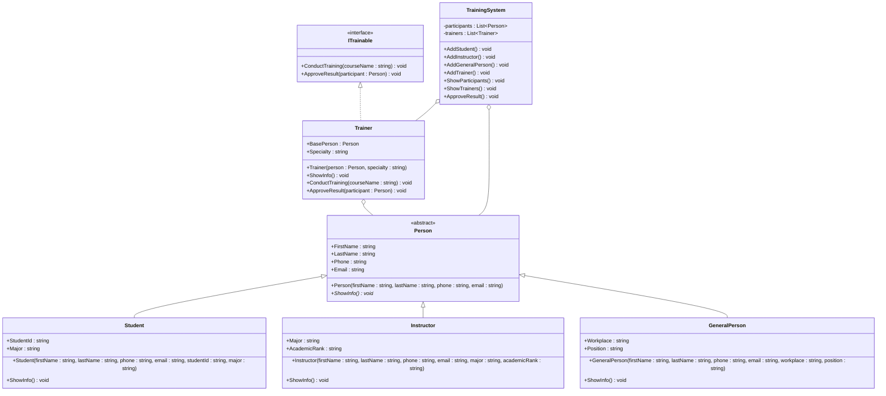

# opp-lap-06
# ปุณณภพ เเสนโสม 683450057-7
# ระบบรับสมัครฝึกอบรม (Training Registration System)

## Class Diagram

## อธิบาย Relationships

| สัญลักษณ์ | ความหมาย | ใช้ตรงไหน |
|---|---|---|
| `<\|--` | Inheritance (สืบทอด) | Student, Instructor, GeneralPerson สืบทอดจาก Person |
| `<\|..` | Realization (implement interface) | Trainer implement ITrainable |
| `o--` | Aggregation (มีความสัมพันธ์แต่อยู่ได้โดยไม่พึ่งกัน) | Trainer เก็บ Person / TrainingSystem เก็บ List |

## อธิบาย Class แต่ละตัว

### ITrainable (Interface)
- กำหนดว่าวิทยากรต้องทำอะไรได้บ้าง
- `ConductTraining()` → ดำเนินการอบรม
- `ApproveResult()` → อนุมัติผลการอบรม

### Person (Abstract Class)
- class แม่ของทุกคนในระบบ
- เก็บข้อมูลพื้นฐาน ชื่อ นามสกุล เบอร์ Email
- `ShowInfo()` เป็น abstract → class ลูกต้อง override เอง

### Student
- สืบทอดจาก Person
- เพิ่ม `StudentId` และ `Major`

### Instructor
- สืบทอดจาก Person
- เพิ่ม `Major` และ `AcademicRank` (อาจารย์, ผศ., รศ., ศ.)

### GeneralPerson
- สืบทอดจาก Person
- เพิ่ม `Workplace` และ `Position`

### Trainer
- implement ITrainable
- เก็บ `BasePerson` ที่เป็น Instructor หรือ GeneralPerson
- มีความสามารถ `ConductTraining()` และ `ApproveResult()`

### TrainingSystem
- class หลักจัดการทุกอย่าง
- เก็บ `List<Person>` และ `List<Trainer>`
- มี method สำหรับเพิ่มข้อมูลและแสดงผล
