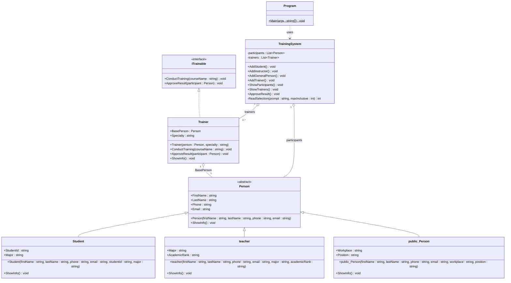

# opplap 06
# นายปุณณภพ เเสนโสม
# ระบบรับสมัครฝึกอบรม (Training Registration System)
## Class Diagram

## อธิบาย Relationships

| สัญลักษณ์ | ชื่อ | ใช้ตรงไหน |
|---|---|---|
| `<\|--` | Inheritance | Student, teacher, public_Person สืบทอด Person |
| `<\|..` | Realization | Trainer implement ITrainable |
| `o--` | Aggregation | TrainingSystem เก็บ List / Trainer เก็บ Person |
| `..>` | Dependency | Program เรียกใช้ TrainingSystem |

## อธิบาย Visibility

| สัญลักษณ์ | ความหมาย |
|---|---|
| `+` | public |
| `-` | private |
| `*` | abstract method |
| `$` | static method |

## อธิบาย Class แต่ละตัว

### ITrainable (Interface)
- กำหนด Contract ของวิทยากร
- `ConductTraining()` ดำเนินการอบรม
- `ApproveResult()` อนุมัติผลการอบรม

### Person (Abstract Class)
- class แม่ของทุกคนในระบบ
- `ShowInfo()` เป็น abstract ให้ class ลูก override

### Student
- สืบทอด Person
- เพิ่ม `StudentId` และ `Major`

### teacher
- สืบทอด Person
- เพิ่ม `Major` และ `AcademicRank`

### public_Person
- สืบทอด Person
- เพิ่ม `Workplace` และ `Position`

### Trainer
- implement `ITrainable`
- เก็บ `BasePerson` ที่เป็น teacher หรือ public_Person
- มี `Specialty` ความเชี่ยวชาญ

### TrainingSystem
- จัดการ List ของ participants และ trainers
- มี method เพิ่มข้อมูล แสดงผล และอนุมัติ

### Program
- `Main()` เป็น static method วนลูปเมนู
